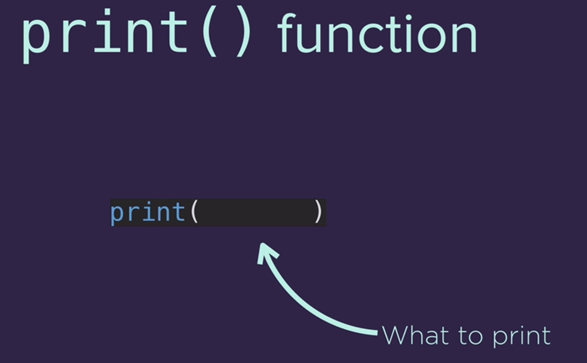
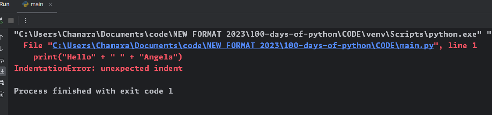
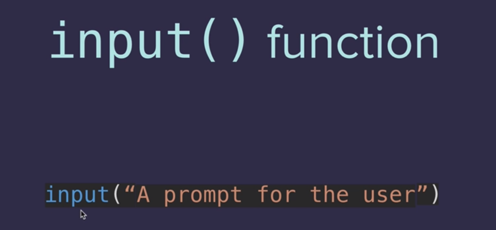

# 100 days of python
- [100 days of python](#100-days-of-python)
  - [Day 1](#day-1)
    - [006 Printing to the Console in Python](#006-printing-to-the-console-in-python)
    - [String concatenation and code intelligence](#string-concatenation-and-code-intelligence)
    - [012 \[Interactive Coding Exercise\] Input Function](#012-interactive-coding-exercise-input-function)
    - [013 Python Variables](#013-python-variables)
    - [014 \[Interactive Coding Exercise\] Variables](#014-interactive-coding-exercise-variables)
    - [015 Variable Naming](#015-variable-naming)
    - [017 Day 1 Project Band Name Generator](#017-day-1-project-band-name-generator)

## Day 1

### 006 Printing to the Console in Python

```python
print("hello world")
```
this will print hello world to the console
```shell
hello world
```


we can use plus to concatenate strings
```python
print("hello" + " " + "world")
```
```shell
hello world
```
### String concatenation and code intelligence

spaces in python are important
```python
  print("hello" + "world")
```



```python
# to print each line in a new line
print("Day 1 - Python Print Function\nThe function is declared like this:\nwhat to print")
```




```python
# save the input in a variable
name = input("what is your name? ")
# use the variable in a message
print("Hello, " + name + "!")

```

```shell
what is your name? 123
Hello, 123!
```
### 012 [Interactive Coding Exercise] Input Function 

```python
# save the input in a variable
name = input("what is your name? ")
# convert the number to a string
nameLength = str(len(name))

# print the length of the name
print(name+" your name is " + nameLength + " letters long")
```
```shell
what is your name? chamara
chamara your name is 7 letters long
```

### 013 Python Variables
```python
nameLength = str(len(name))
```
### 014 [Interactive Coding Exercise] Variables

```python
input1 = input("Enter first number: ")
input2 = input("Enter second number: ")

c = input1
input1 = input2
input2 = c

print("a", input1)
print("b", input2)
```

```shell
Enter first number: 111111111
Enter second number: 22222222
a 22222222
b 111111111
```

### 015 Variable Naming
make your code readable
use snake case
```python
user_name = "chamara"
```

can't start with a number
```python
1user_name = "chamara"
```
```shell
  File "main.py", line 1
    1user_name = "chamara"
     ^
SyntaxError: invalid syntax
```

can't use special characters
```python
user@name = "chamara"
```
```shell
  File "main.py", line 1
    user@name = "chamara"
    ^
SyntaxError: cannot assign to operator
```

### 017 Day 1 Project Band Name Generator

```python
print("Well come to Name Generator")
city_name = input("What is the name of the city you grew up in?\n")
name_of_your_pet = input("What is the name of your pet?\n")
print("Your band name could be " + city_name + " " + name_of_your_pet)
```
```shell
Well come to Name Generator
What is the name of the city you grew up in?
colombo
What is the name of your pet?
pet
Your band name could be colombo pet

```